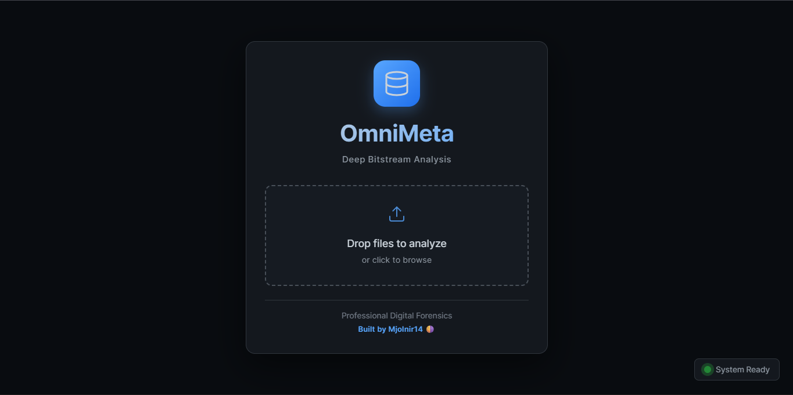
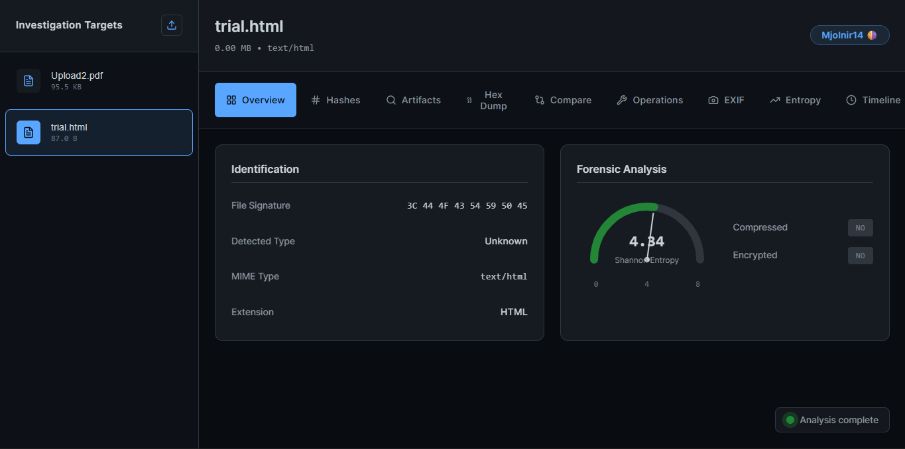
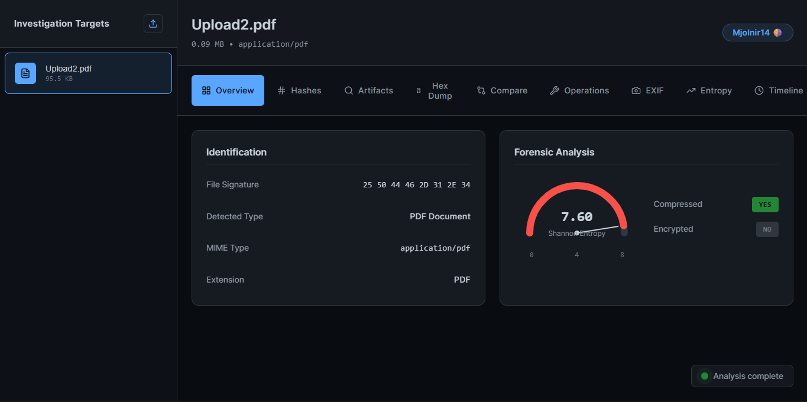

# 🔍 OmniMeta - Universal File Intelligence System

**A comprehensive forensic analysis platform for digital evidence examination.**

[](https://omni01101101.netlify.app/)


---

### 🌐 [Visit the Live App here](https://omni01101101.netlify.app/)

---



## ✨ Features

* 🔐 **5 Cryptographic Hashes** (MD5, SHA-1/256/384/512)
* 📸 **EXIF Deep Dive** with GPS privacy analysis
* ⏰ **MACB Timeline** reconstruction
* 🎭 **Steganography** detection & implementation
* 📊 **Entropy Visualization** for encryption detection
* ✂️ **File Carving** to extract embedded files
* 🔄 **Duplicate Detection** with hash comparison
* 🔐 **Encryption/Decryption** (AES-256-GCM)
* ✍️ **Digital Signatures** (RSA-PSS)
* 📱 **QR Code** generation for evidence tracking
* 📄 **Forensic Reports** (JSON/HTML/PDF)
* 🔍 **Pattern Extraction** (emails, IPs, credit cards)

## 🎯 Use Cases

* Digital Forensics & Incident Response
* CTF Competitions
* Security Research
* Evidence Documentation
* File Analysis & Recovery

## 🚀 Getting Started
```
# Install dependencies
npm install

# Start development server
npm run dev

```

## 🛠️ Built With

* **React + Vite** - Modern UI & fast development
* **Web Crypto API** - Client-side cryptographic operations
* **Canvas API** - Low-level image processing
* **exifr** - High-performance metadata extraction
* **qrcode & jsQR** - QR generation and scanning

## 📸 Screenshots

| Dashboard & Main Interface | Forensic Metadata Analysis |
|---|---|
|  |  |

| Cryptographic Tools | Advanced Analysis & Reports |
|---|---|
|  |  |

## 🎓 Learning Project

This project was built as a learning exercise in:

* File format analysis
* Cryptographic operations
* Forensic techniques
* React state management
* Binary data manipulation

## ⚖️ Legal Notice

This tool is for **educational and legitimate forensic purposes only**. Always obtain proper authorization before analyzing files.

## 👤 Author

**Leonel Sebastian (Mjolnir14)**

* Built with assistance from Claude (Anthropic)
* [LinkedIn](https://www.linkedin.com/in/leonel-sebastian/)

## 📝 License

This project is licensed under the MIT License - see the LICENSE file for details.

---

⭐ Star this repo if you find it useful!
